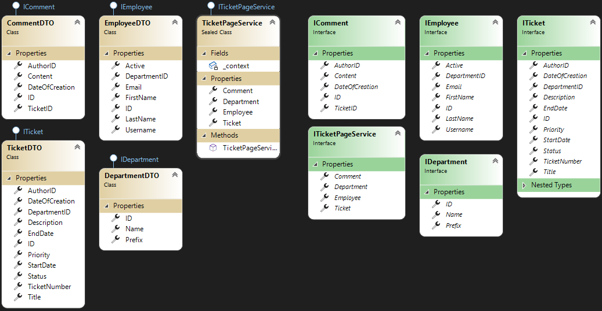

# Introduction
A port from MVC and pure SQL to Razor Pages and EFCore. The project is written from scratch and serves as the 3rd verison of **Opgaveside**.

# Project Details
| Platform       | GUI         | Timeframe | Database Solution                   |
|----------------|-------------|-----------|-------------------------------------|
| Web Aplication | Razor Pages | August    | SQL via Entity Framework & Identity |

## Setup
**TicketPage** must be put up as `Https` otherwise **SSO** won't work as intended. Local sign in will still work, though.
**Docker support** should be enabled but was only testet in an earlier version (_[7183d661](https://git.pcsyd.dk/Opgaveside/OpgavesideV2/-/commit/7183d66105d58fcbaa91a49f5483c4a41e02acca)_).

**Note:** SSO won't work as the system was ment to run in a specific environment. Local Sign-in should still work.

## Dependencies
- **Domain**
  - [Microsoft.AspNetCore.Identity.EntityFrameworkCore (_5.0.13_)](https://www.nuget.org/packages/Microsoft.AspNetCore.Identity.EntityFrameworkCore/5.0.13)
  - [Microsoft.AspNetCore.Identity.EntityFrameworkCore (_5.0.13_)](https://www.nuget.org/packages/Microsoft.AspNetCore.Identity.EntityFrameworkCore/5.0.13)
  - [Microsoft.Extensions.Configuration (_5.0.13_)](https://www.nuget.org/packages/Microsoft.Extensions.Configuration/5.0.13)
  - [Microsoft.Extensions.Configuration.Json (_5.0.0_)](https://www.nuget.org/packages/Microsoft.Extensions.Configuration.Json/5.0.0)
  - [Microsoft.EntityFrameworkCore.SqlServer (_5.0.13_)](https://www.nuget.org/packages/Microsoft.EntityFrameworkCore.SqlServer/5.0.13)
  - [Microsoft.EntityFrameworkCore.Tools (_5.0.13_)](https://www.nuget.org/packages/Microsoft.EntityFrameworkCore.Tools/5.0.13)
- **Services**
  - [Microsoft.AspNetCore.Identity (_2.2.0_)](https://www.nuget.org/packages/Microsoft.AspNetCore.Identity/2.2.0)
- **Web**
  - [Microsoft.AspNetCore.Authentication.WsFederation (_5.0.13_)](https://www.nuget.org/packages/Microsoft.AspNetCore.Authentication.WsFederation/5.0.13)
  - [Microsoft.AspNetCore.Diagnostics.EntityFrameworkCore (_5.0.13_)](https://www.nuget.org/packages/Microsoft.AspNetCore.Diagnostics.EntityFrameworkCore/5.0.13)
  - [Microsoft.AspNetCore.Identity.EntityFrameworkCore (_5.0.13_)](https://www.nuget.org/packages/Microsoft.AspNetCore.Identity.EntityFrameworkCore/5.0.13)
  - [Microsoft.EntityFrameworkCore.Design (_5.0.13_)](https://www.nuget.org/packages/Microsoft.EntityFrameworkCore.Design/5.0.13)
  - [Microsoft.EntityFrameworkCore.SqlServer (_5.0.13_)](https://www.nuget.org/packages/Microsoft.EntityFrameworkCore.SqlServer/5.0.13)

See the [WiKi](https://git.pcsyd.dk/Opgaveside/OpgavesideV2/-/wikis/home) for more in depth information about the project.

## Initial Features
- **Functionality**
  - [X] **Login System**: Implemented through 3rd party access
  - [X] **Tickets**
    - [X] **CRUD**: Implemented via a service repository
    - ID
    - First Name
    - Last Name
    - Rank
    - Active
    - Groups
    - Email
    - School
  - [X] **Departments**
    - [X] **CRUD**: Implemented via a service repository
    - ID
    - Name
    - Tasks
  - [X] **Employees**
    - [X] **CRUD**: Implemented via a service repository
    - ID
    - DateOfCreation
    - EndDate
    - [Department]()
    - Author
    - Assigned User
    - Priority
    - Status
    - Tital
    - Description
    - Comments
  - [X] **Comments**
    - ID
    - [Ticket]()
    - Author
    - Content
    - DateOfCreation
- **Pages**
    - [X] **Front**
    - [X] **Login**
    - [X] **Admin Panel**
      - [X] All Tasks
        - [X] Filter
          - Current Tasks
          - Paused Tasks
          - Completed Tasks
          - Requests
          - Incomming
          - Free Search
        - [X] New Task
        - [X] Delete Task (Admin/Developer Only_)
        - [X] Edit Task (Admin/Developer Only_)
      - [X] All Users
        - [X] Deactivate User (_Admin/Developer Only_)
        - [X] Edit User (_Admin/Developer Only_)
        - [X] Delete User (_Developer Only_)
        - [X] Filter
          - [Department]()
          - Active/Inactive
          - Free Search
        - User Cards
          - Name
          - Delete
          - Promote
    - [X] **[Employee]()**
      - Display Info
    - [X] **Task**
      - [X] Display Info
      - [X] New Comment
      - [X] Edit Comment (_Owner/Admin/Developer Only_)
      - [X] Delete Comment (_Owner/Admin/Developer Only_)
      - [X] Assign [Employee]() (_Owner/Admin/Developer Only_)
      - [X] Remove [Employee]() (_Owner/Admin/Developer Only_)
      - [X] New Task
      - [X] Delete Task (_Owner/Admin/Developer Only_)
      - [X] Edit Task (_Owner/Admin/Developer Only_)
    - [X] **[Monitor]()**
      - Task Groups
        - Amount of tasks
		- Task Cards
          - Priority
          - Status
          - Task Header
          - Task Description
          - Task Serial Number
          - Responsible User
    - [X] **Contact**
    	- Contact Info
        - Open Hours
## Additional Features
- **Requested Changes**
  - [X] Case number for tickets (_Automated based on Department_)
  - [X] Middle Management role (_Base, Admin, Instructor_)
    - [X] **Base:** A normal user with minimal access
    - [X] **Admin:** An elevated user that has access to ticket management
    - [X] **Instructor:** A super user that has access to the entire system.
  - [X] A more comprehensive [Monitor]() View
- **Additional QoL Improvements**
  - [X] Easy [Ticket]() processing pipeline
  - [X] [Department]() Management
  - [X] Comments generated from an edit should be formatted better
        and apply to all areas of edit, including _Easy Process_ buttons
  - [X] [Ticket]() description and comment content should support hyperlinks
  - [X] A **warning** when deleting _departments_ to notify that all tickets
        connected will also be removed
  - [X] A '_Do you want to_' display that offers to change all case numbers for tickets if their department changes prefix
- **Known Issues**
  - [X] Deleting an _employee_ that has written _comments_ and/or raised _tickets_ will
        result in a DB error as the 'Author' column can't be **null** in either case.
  - [X] If two ListPartial with filters exist on the same page the filter will use the
        same 'FilterOptions' property. This is not intended.
  - [X] Attempting to sign in with an account that does not exist might throw an 'NullReferenceException'.

## Entity Relation Diagram

## Class Diagrams
### Domain

### Services

# Version Control Standards
- **Versioning**
  - Version Template: _[_Major_].[_Minor_].[_Patch_]-[StateMod]_.
  - `Major:`
    - Major Changes
    - Changes to Core structure (_Like an UI Switch_)
  - `Minor:`
    - 100 _Minor_ versions = 1 _Major_ version
    - Features
    - Large Code Refactoring (_Ex. If you create a new file when refactoring_)
  - `Patch:`
    - 1000 _Path_ versions = 1 _Minor_ version
    - Hotfixs
    - Revisions
    - Minor Code Refactoring
  - `StateMod:`
    - Can either be _Dev_ or _Rel_ and defines the state of the version. _Dev_ meaning the version is on the Development branch, while _Rel_ means it's on the Release branch and therefore published.
      > Exmaple: v0.10.3-Dev
  - When a _Major_ version is applied it resets the version count, same goes for a _Minor_ version.
      > Example: v0.55.15-Rel -> v1.0.0-Rel | v0.99.56-Dev -> v0.99.0-Dev
- **Source Control**
    - `Features` must be branched out and developed on an isolated branch and merged back into the `Developer` branch when done.
    - `Branches` must be named as follows: *[MajorVersion]/[YouInitials]/[FeatureName]*.
      > Example: v0/MSM/ExampleBranch.
- **Code**
  - `Namespaces` must be constructed as follows: _SKP.[ProjectName].[FolderName]_.
  - `Fields` must be _private_.
  - `Properties` must be _public_ or _protected_.
  - `Interfaces` are suffixed with 'I' and nothing else.
  - `Interfaces` must have their own subfolder, which should never be included in their `namespace`.
  - `Method` parameters must be suffixed with an '_'.
  - `Scopes` must have explicit enclosure.

## Change Log
_`Classes`, `structs`, `interfaces` and `enums` etc. are to be linked to the project WiKi Page._
 - **[v3.3.2-Rel](https://git.pcsyd.dk/Opgaveside/OpgavesideV2/-/tags/v3.3.2-Rel)**
      - **Modified**
        - [TicketPage]() Changed so Admins now can add employees to a task
        - [TickListPartial]() Chaned so Admins now can edit tasks
 - **[v3.19.3-Dev](https://git.pcsyd.dk/Opgaveside/OpgavesideV2/-/tags/v3.19.3-Dev)**
     - **Notes**
         - Refactored role handlers to make use of constants. This change is quite large, however, not much as changed. behaviour remains the same  but roles are now defined as constants and the change had to be applied to all relevant files.
         - Corrected wrong dropdown header on [LogOverview])( page
    - **Added**
        - [RoleHelper]() to introduce [Role]() constants and athorization role constants
    - **Modified**
        - [LogOverview]() page
 - **[v3.19.2-Dev](https://git.pcsyd.dk/Opgaveside/OpgavesideV2/-/tags/v3.19.2-Dev)**
     - **Notes**
         - Corrected `v031800` migration file to avoid conflicts
 - **[v3.19.1-Dev](https://git.pcsyd.dk/Opgaveside/OpgavesideV2/-/tags/v3.19.1-Dev)**
    - **Notes**
        - Changed the color of 'Important' priority and 'Ongoing' status bubbles from *sgreen* to *pgreen*.
        - Implemented a button to toggle the Stack Trace of errors logs
    - **Modified**
        - [MonitorLayout]()
        - [Site](): Added toggle(id) function
        - [EmployeeListPartial]()
        - [TicketCardPartial]()
        - [TicketListPartial]()
        - [SiteTheme](): Introduced _sgreen_ as the former _pgreen_ and _pgreen_ is now a darker _green_.
        - [UserPage]()
        - [LogOverview](): Added button for Stack Trace toggle
        - [ErrorLogger](): Optimized DB lookup
    - **Fixed**
        - An issue where monitor quick navigation All[0] redirected to the wrong endpoint
        - An issue where "Owned Tickets" on UserPage didn't filter out 'Completed' tickets when accepted.
 - **[v3.19.0-Dev](https://git.pcsyd.dk/Opgaveside/OpgavesideV2/-/tags/v3.19.0-Dev)**
    - **Notes**
        - If unhandled exceptions are thrown the log system will automatically log them as critical entries with a stack trace attached. The system also provides manual logging of **critical**, **warning** and **informational** entries.
    - **Added**
        - [LogOverview]() page
        - [IErrorLogger]() as the public logger interface
        - [ErrorLogger]() to act as the Repository and logger entry for log entries
        - [ILogEntry]() as the public mask for LogEntries
        - [LogEntry]() as the Db specific log entity
        - [ServiceCollectionExtensions]()
        - [LogEntryExtensions]()
        - [LogEntryDTO]()
        - [LogEntryFilterOptions]()
    - **Modified**
        - [StartUp](): Added logging service
        - [AdminPanel]() page: Added button for Log Entry overview
        - [TicketPageContext]() to include seed data for LogEntries
        - [Error]() page: Errors that result in a redirect are now logged and stored in DB as a Critical error.
        - [ExternalLogin]() page to implement the new IErrrorLogger functionality
 - **[v3.18.0-Dev](https://git.pcsyd.dk/Opgaveside/OpgavesideV2/-/tags/v3.18.0-Dev)**
    - **Notes**
        - The ticket list partial now supports a quick _pause/unpause_ button in list view. The button is only availble as long as the ticket is not set as **Inbound**, **Completed** and/or **Denied**.
        - The monitor view now supports a dropdown that allows for quick and simple navigation through prefix view.
        - Comments on the TicketPage are now hidden by default. Only 5 are displayed instially the rest can be displayed with a button press (_And also hidden again_).
    - **Modified**
        - [UserPage]() model to make use of the _pause/unpause_ feature
        - [TicketCardViewPartial](): Added dark text for Paused status tag bubble
        - [MonitorLayoutPartial](): Added selection box for quick navigation regarding prefix view
        - SiteTheme: Added a new custom style: 'cust-select-primary'
        - Site: Added a new function: 'redirectToPrefixMonitor(element)' and added 3 new functions: **showComments**, **hideComments** and **createButton**.
        - [TicketPage](): Implemented a way to _hide/show_ comments on TicketPage
 - **[v3.17.7-Dev](https://git.pcsyd.dk/Opgaveside/OpgavesideV2/-/tags/v3.17.7-Dev)**
    - **Notes**
        - Implemented pagination support for partial list views
    - **Modified**
        - [TicketRepository](): Tickets are now ordered by TicketNUmber by default when getting all fromDB
        - [UserPage]() now implements the new pagination
        - [UserPage]() model has been configured to make use of the pagination
        - [DepartmentListPartial](): Added pagination support
        - [DepartmentListPartial]() model
        - [TicketListPartial](): Added pagination support
        - [TicketListPartial]() model
        - [EmployeeListPartial](): Added pagination support
        - [EmployeeListPartial]() model
        - [DepartmentOverview](): Integrated pagination
        - [DepartmentOverview]() model
        - [TicketOverview](): Integrated pagination
        - [TicketOverview]() model
        - [EmployeeOverview](): Integrated pagination
        - [EmployeeOverview]() model
        - [TicketRepository]()
    - **Fixed**
        - An issue where users couldn't search for ticket numbers in free text search
 - **[v3.17.6-Dev](https://git.pcsyd.dk/Opgaveside/OpgavesideV2/-/tags/v3.17.6-Dev)**
    - **Modified**
        - [EmployeeFormPartial]()
        - [EmployeeListPartial](): Developer accounts can now be deactivated
        - [ExternalLogin]() model
    - **Fixed**
        - An issue where roles wouldn't be assigned as intended
        - An issue where developers couldn't access the UserPage of users without a department because the ID instance would be null.
 - **[v3.17.4-Dev](https://git.pcsyd.dk/Opgaveside/OpgavesideV2/-/tags/v3.17.4-Dev)**
    - **Notes**
        - Imported employees should no longer recieve another role if they already have a role and the matched external user signs in.
    - **Modified**
        - [UserPage](): Completed tickets are now filtered out of Owned and Assigned tickets by default on userpage
        - [ClaimsPrincipalExtensions](): Formatting
        - [EmployeeExtensions](): Added HasRole extension
        - [ExternalLogin]() model to check if an employee already has a role before auto assigning a new role
        - [EmployeeListPartial](): Corrected the modal popup text for deleting employees. The message now correctly represents the action taken.
        - [MonitorSinglePartial](): Replaced Completed tickets with Paused tickets on monitor single view
        - [TicketCardViewPartial](): Changed Employee name highlight from blue to yellow
        - [Index]() page: Corrected open hours from 1534 to 1524 in index page and replaced PC Syd log with SBO on index
        - [MonitorLayoutPartial](): Removed background image from monitor view
 - **[v3.17.3-Dev](https://git.pcsyd.dk/Opgaveside/OpgavesideV2/-/tags/v3.17.3-Dev)**
    - **Modified**
        - [TicketPageContext]()
        - [EmployeeOverview](): Employees are now ordered alphabetically
        - [EmployeeManager](): Now makes a null check before removing or assigning roles
        - [EditUser](): Invalid role selction will now display a warning
        - [ExternalLogin](): Employees are not automatically assigned a role when signing in
    - **Fixed**
        - An issue where a user role couldn't be assigned if a user didn't have a role
 - **[v3.17.2-Dev](https://git.pcsyd.dk/Opgaveside/OpgavesideV2/-/tags/v3.17.2-Dev)**
     - **Modified**
         - [TicketListPartial](): Should not show completed or denied anymore
         - [TicketOverview](): Should also not show completed or denied in view
         - [TicketRepository](): Tickets can now be filtered by Ticket number
 - **[v3.17.1-Dev](https://git.pcsyd.dk/Opgaveside/OpgavesideV2/-/tags/v3.17.1-Dev)**
     - **Notes**
         - Implemented a way to match employees. Because mapping is done from old DB to new DB I've implemented a way to match existing users to SSO authenticated users.
    - **Modified**
        - [Employee](): First and Last name can now hold 50 characters each instead 25
        - [ExternalLogin]() page: This is where the matching is done
        - [EmployeeFormPartial](): Having no role shouldn't throw an exception anymore
 - **[v3.17.0-Dev](https://git.pcsyd.dk/Opgaveside/OpgavesideV2/-/tags/v3.17.0-Dev)**
    - **Notes**
        - The prefix of a department can now be excluded from a ticket number. This is done to allow the department to be displayed in Monitor View via prefix but still keep tickets without a prefix.
    - **Modified**
        - [TicketExtensions]() to include the method
        - [TicketPageCreate]() page to make use of the new implementation
        - [TicketPageContext](): Corrected default departments in seed
        - [TicketListPartial]() to now displays ticket number instead of date of creation
        - [TicketPage]() to now list comments in descending order
        - [MonitorAllPartial](): Changed the monitor view to not include completed tickets
        - [TicketListPartial](): Tickets not marked as Inbound can't be deleted now
        - [Department entity](): now includes InldudePrefix property
        - [TicketPageContext]() to insert the new property in seed data
        - [DepartmentDTO]() to also include the new property
        - [DepartmentExtensions](): Mappers now map the new property
        - [TicketExtensions](): Ticket number generator will now generate a number based on whether or not a department has the IncludePrefix property set to true or not
        - [IDepartment]() now includes the IncludePrefix property aswell
        - [DepartmentFormPartial]() to now displays the IncludePrefix property and allows for the user to change it at will
        - [DepartmentListPartial]() to now show the IncludePrefix property
        - [DepartmentPageEdit]() page to handle the IncludePrefix proeprty
    - **Fixed**
        - Spelling on Error Page
        - An issue that resulted in tickets being created as 'Pending'
 - **[v3.16.8-Dev](https://git.pcsyd.dk/Opgaveside/OpgavesideV2/-/tags/v3.16.8-Dev)**
    - **Fixed**
        -  An issue where tickets couldn't be created if no tickets existed in the department
 - **[v3.16.7-Dev](https://git.pcsyd.dk/Opgaveside/OpgavesideV2/-/tags/v3.16.7-Dev)**
    - **Modified**
        - [TicketDTO](): Display format to Start- and EndDate
 - **[v3.16.6-Dev](https://git.pcsyd.dk/Opgaveside/OpgavesideV2/-/tags/v3.16.6-Dev)**
    - **Added**
        - Docker Support
 - **[v3.16.5-Dev](https://git.pcsyd.dk/Opgaveside/OpgavesideV2/-/tags/v3.16.5-Dev)**
    - Made TicketNumber Serial begin from one (1)
    - Made [Department]() prefix nullable on front end
    - Made employee filter parameters lockable.
    - Made is so that users can't be deleted if they have raised tickets or comments
    - Added default departments to seed data
    - Reduced monitor refresh timer to 15 minutes instead of 30.
    - **Fixed**
        - An issue where a new ticket's serial number would cause an error.
 - **[v3.16.4-Dev](https://git.pcsyd.dk/Opgaveside/OpgavesideV2/-/tags/v3.16.4-Dev)**
    - **Fixed**
        - an issue that resulted in a visual glitch in Firefox when not setting timestamp og due date and start date
 - **[v3.16.3-Dev](https://git.pcsyd.dk/Opgaveside/OpgavesideV2/-/tags/v3.16.3-Dev)**
    - **Fixed**
        - Title and description should no longer overflow
        - Outline should now appear correctly around comments in focus
 - **[v3.16.2-Dev](https://git.pcsyd.dk/Opgaveside/OpgavesideV2/-/tags/v3.16.2-Dev)**
     - **Fixed**
        - Translated auto comments for adding/removing employees form tickets
        - [TicketPage]() should no longer throw an "Comment can't be empty" error upon adding/removing employees from tickets.
 - **[v3.16.1-Dev](https://git.pcsyd.dk/Opgaveside/OpgavesideV2/-/tags/v3.16.1-Dev)**
    - **Fixed**
        - [UserPage]() should no longer crash when employees don't have a department
        - [Employee]() Filter should no longer cause comment form to complain
        - [Employee]() filter should now filter assginable employees as well
        - Assigned tickets should now filter correctly after a ticket was bubbled
        - Refreshing [EmployeeOverview]() should no longer cause the promotion or activation action to be repeated
        - Priority and status in [Ticket]() lists should be more readable now
 - **[v3.16.0-Dev](https://git.pcsyd.dk/Opgaveside/OpgavesideV2/-/tags/v3.16.0-Dev)**
    - **Added**
        - [RoleDTO]() as an open container for [Role]()
        - [IRole]() as the public mapped container for [Role]()
        - [RoleExtensions]()
    - **Modified**
        - [EmployeeListPartial](): Added User.IsSelf([Employee]()) as condition
        - [DepartmentListPartial](): Setting buttons should now show as muted instead of a blank box
        - [EmployeeListPartial](): Setting buttons should now show as muted instead of a blank box
        - [TicketListPartial](): Setting buttons should now show as muted instead of a blank box
        - [ClaimsPrincipalExtensions](): Added a GetMail method
        - [ExternalLogin]() model: Added sign out redirect if an employee is deactivated
        - Login page: Added validation summary
        - [CommentDTO](): Content is now limited to 1225 characters
        - [TicketDTO](): Title is now limited ot 50 characters and description to 2450
        - [Role]() to include a 'DisplayName' property to make translation easier
        - [TicketPageContext](): Updated seed data to represent new data model
        - [EmployeeExtensions](): Renamed GetRoleAsync to GetRoleNameAsync to represent its function better.
        - [TicketExtensions](): Made some methods comply with new structure
        - [IEmployee](): Removed Helper class as it's no longer needed.
        - [IEmployeeManager](): Added methods to control simple role functionality
        - [EmployeeManager](): Updated to comply with interface changes
        - [TicketPageService](): Injecting RoleManager now
        - Made changes to various pages to make them comply with the new structure
     - **Fixed**
        - Privacy page should now be removed
 - **[v3.15.5-Dev](https://git.pcsyd.dk/Opgaveside/OpgavesideV2/-/tags/v3.15.5-Dev)**
    - **Modified**
        - [EmployeeExtensions](): Is[Role]()] methods now check for the absence of a role instead og assuming employee have one
        - [ExternalLogin]() model: Added a scope to ensure users are assigned are role in case they're not part of the designated groups
        - [MonitorLayout](): Added "overflow:hidden" to html tag
        - TicketCardViewPartial: Added @ to auther.LastName
        - [TicketFormPartial](): Corrected start date input tag
        - [TicketPageEdit](): Start date is now mapped correctly
        - [ITicket](): Made switch helpers return string.empty if provided with an invalid enum value
        - [TicketFormPartial](): Status and priority now loads with the correct color
        - [TicketListPartial](): Filters now maintain the color for status and priority upon submissions
        - [CommentCardPartial](): Added "word-break:break-all" to comment content div
        - [TicketPageCreate]() model: An error message should now be displayed upon submission of invalid date stamps
        - [TicketPageEdit]() model: An error message should now be displayed upon submission of invalid date stamps
 - **[v3.15.4-Dev](https://git.pcsyd.dk/Opgaveside/OpgavesideV2/-/tags/v3.15.4-Dev)**
    - **Modified**
        - Cleaned up Error page and made it more user friendly
    - **Fixed**
        - Missing translation on Overview headers
        - [Ticket]() Cards not showing first name of author
        - [Monitor]() crashing if no prefix was provided
        - [Monitor]() accepting alpha numeric indexers
        - Missing translation on ticket form headers
        - Missing translation on header for assigned employees
        - Missing translation on employee roles
 - **[v3.15.3-Dev](https://git.pcsyd.dk/Opgaveside/OpgavesideV2/-/tags/v3.15.3-Dev)**
     - **Fixed**
         - Fixed an issue where auto comments didn't anchor users
 - **[v3.15.2-Dev](https://git.pcsyd.dk/Opgaveside/OpgavesideV2/-/tags/v3.15.2-Dev)**
     - **Fixed**
         - Corrected several issues related to bad error messages
         - Fixed an issue where [Ticket]().StartDate would be considered earlier than 'now' as the seconds of the stamp would be ahead.
 - **[v3.15.1-Dev](https://git.pcsyd.dk/Opgaveside/OpgavesideV2/-/tags/v3.15.1-Dev)**
     - **Fixed**
         - Employees can now be assigned to tickets again
 - **[v3.15.0-Dev](https://git.pcsyd.dk/Opgaveside/OpgavesideV2/-/tags/v3.15.0-Dev)**
    - **Modified**
        - [CommentDTO]() 'Content' property is not marked as required
        - [CommentCardPartial]() to support the new rich text feature
        - [CommentFormPartial]() implemented support for CKEditor
        - [TicketFormpartial]() implemented support for rich text
        - [Layout]() to include the styles sheet (for CK editor)
        - [TicketPage](): Added CKEditor JS dependencies
        - [TicketPageCreate](): Added CKEditor JS dependencies
        - [TicketPageEdit](): Added CKEditor JS dependencies
        - [EmployeeExtensions](): Added a 'IsSystem' method
        - [DeveloperLoginModel]() to supoprt account without a username
        - [AutoComment](): Corrected bad translation
        - [DepartmentListPartial](): Mad eit more clear what happens when deleting a department
        - [EmployeeListPartial](): Added support for 'System' account
        - [TicketFormPartial](): Corrected a bad translation
        - **Fixed**
        - [TicketPage](): Fixed an issue where assigning employees would throw an error
- **[v3.14.3-Dev](https://git.pcsyd.dk/Opgaveside/OpgavesideV2/-/tags/v3.14.3-Dev)**
     - **Fixed**
         - Fixed an issue where employees couldn't be modified
         - Made several changes to fix small issues that lead to undesired behavior
 - **[v3.14.2-Dev](https://git.pcsyd.dk/Opgaveside/OpgavesideV2/-/tags/v3.14.2-Dev)**
     - **Modified**
         - [TicketListPartial](): Made tickets in partial list order only by datefo creation. Descending. This is to avoid tickets jumping around in the list because it's being sorted.
     - **Fixed**
         - Fixed an issue where comments wouldn't be focused as intended when posted, or after an edit
 - **[v3.14.1-Dev](https://git.pcsyd.dk/Opgaveside/OpgavesideV2/-/tags/v3.14.1-Dev)**
    - **Added**
        - [EnumExtensions]() to aid with getting display names for enum value names
    - **Modified**
        - [MonitorAllPartial](): Fixed an issue where all/index would throw a null reference exception on source
         - [ITicket]().Helper to include two new methods for getting display names for status and priority as a range
 - **[v3.14.0-Dev](https://git.pcsyd.dk/Opgaveside/OpgavesideV2/-/tags/v3.14.0-Dev)**
    - **Added**
        - [MonitorViewAllPartial]() to display a range of 4 departments at a time. Supports indexed pagination in query string
        - [MonitorSinglePartial]() to display a single department with inbound, ongoing, pending and completed columns
        - [MonitorLayout]() to form a base layout for the monitor view.
        - AutoScroll JS file
    - **Modified**
        - [TicketCardView]() to be more colorful and detailed
        - [Layout]() view to direct to the new monitor page
        - [Monitor]() page removed all code and layout and implemented the new visual overhaul
        - MonitorModel implemented support for different query like settings
        - [TicketPage]() to hide away the comment form when a user isn't signed in
    - **Fixed**
        - An issue where GetByID for departments would throw a null reference exception
        - An issue in [ClaimsPrincipalExtensions]() that threw an exception if no user was found when getting ID.
        - An issue where comments could be edited by any user.
 - **[v3.13.8-Dev](https://git.pcsyd.dk/Opgaveside/OpgavesideV2/-/tags/v3.13.8-Dev)**
    - **Modified**
        - [CommentExtensions](): Removed a method that wasn't in use and was marked at obsolete
        - [TicketExtensions](): Added a summary to clearify the use of a method
        - [DepartmentFormModel](): Changed Input to [DepartmentDTO]() instead of DepartmentFormInputModel as the model was no longer necessary
        - [DepartmentFormPartial]() to comply with the changes in the model
        - [CommentFormPartial](): Corrected the table structure as it was invalid
        - [DepartmentOverviewModel](): Removed OnPostDepartmentDeleteAsync as it's no longer used. The functionality was moved to OnPostAcceptAsync instead
        - [DepartmentPageCreate]() to comply with the changes in [DepartmentFormModel]()
        - [DepartmentPageEdit]() to also comply with the changes in the form model
    - **Removed**
 - **[v3.13.7-Dev](https://git.pcsyd.dk/Opgaveside/OpgavesideV2/-/tags/v3.13.7-Dev)**
    - **Modified**
        - [TicketPageContext]() to build an IConfiguration instance
        - [EmployeeListModel]() to include a 'FilterPropertyName' property that holds the name of the bound property
        - [EmployeeListPartial]() to have a more flexible filter
        - [UserPage]() to support the new flexible filter
        - [UserPage]() model to integrate the logic required to make use of the flexible filter
        - [TicketListPartial](): Added a better way of handling the filtering
        - [TicketListModel](): Added a 'FilterPropertyName' property to identify the propertyname of the filteroption to use in filtering
        - [UserPage](): Optimized filter assignment and fixed various issues that prohibited Owned and Assigned tickets from being filtered correctly
        - [DepartmentListPartial](): Added more flexibility to the filtering to match the other Partial list filtering systems
        - [DepartmentListModel]() to incorperate the necessary logic to support the flexible filtering, as well as making filtering remember its options post submission
        - [EmployeeListPartial](): Made filter remember its options post submission
        - [TicketListPartial](): Made filter remember its options post submission
        - [DepartmentOverview](): Added the support for the new flexible department filter
 - **[v3.13.6-Dev](https://git.pcsyd.dk/Opgaveside/OpgavesideV2/-/tags/v3.13.6-Dev)**
    - **Modified**
        - [DepartmentFormPartial](): Removed sync checkbox and added modal window
        - [DepartmentListPartial](): Corrected a spelling mistake
        - [ConfirmationWindowPartial](): Corrected spelling mistake and added shadow to window
        - [DepartmentPageEdit]() to support the modal window instead of the checkbox for sync
 - **[v3.13.5-Dev](https://git.pcsyd.dk/Opgaveside/OpgavesideV2/-/tags/v3.13.5-Dev)**
    - **Added**
        - [ConfirmationWindowPartial](), which is a modal partial view that can be toggled and configured to handle both client- and serverside operations
        - [ConfirmationWindowModel]() as the configuration for the partial of the same name
        - JavaScript for toggling an element in and out of view
        - JavaScript for triggering a Confirmation partial
    - **Modified**
        - [TicketExtensions]() to include functionality for chaning ticket number prefix
        - [DepartmentFormModel](): Added DepartmentFormInputModel to act as setting model
        - [DepartmentFormPartial]() to support the setting model and include a 'Sync Prefix' checkbox
        - [DepartmentPageCreate]() to work around the new setting model
        - [DepartmentPageEdit]() model to support the new setting model and sync functionality
        - [DepartmentListPartial](): Integrated modal into view
        - [DepartmentOverview]() Integrated modal support
 - **[v3.13.4-Dev](https://git.pcsyd.dk/Opgaveside/OpgavesideV2/-/tags/v3.13.4-Dev)**
    - **Added**
        - [AutoComment]() as a helper class
    - **Modified**
        - [DeveloperLogin]() to ensure disbaled accounts can't sign in and non existing accounts wont throw an error
        - [UserPage]() to make use of the new [AutoComment]() class
        - [TicketOverview]() to make use of the new [AutoComment]() class
        - [TicketPageEdit]() to also make use of the new class
 - **[v3.13.3-Dev](https://git.pcsyd.dk/Opgaveside/OpgavesideV2/-/tags/v3.13.3-Dev)**
    - **Added**
        - [DepartmentFilterOptions]()
        - [DepartmentListModel]() as the backend for the partial view
        - [DepartmentListPartial](), which is a list view for departments
        - [DepartmentOverview]() page, which contains the department management properties
        - [DepartmentOverview]() model
        - [DepartmentFormModel]() as the backend for the form partial
    - **Modified**
        - [Ticket](): Rearranged status enum
        - [ITicket](): Rearranged status enum
        - [UserPage]() page to support the new enum structure and processing pipeline
        - [UserPage]() model to support the new processing pipeline
        - TicketFormPagepartial to support the new enum structure
        - [TicketListPartial]() to support new enum structure and processing pipeline
        - [TicketOverview]() to support new processing pipeline
        - [TicketPage]() to support new enum structure
        - [CommentCardPartial](): 'Edit' and 'Delete' buttons should be display better. Comment content now supports raw html.
        - [TicketPageEdit](): 'User Link' is now provided with an edit comment
        - [IDepartmentRepository]() to support filtering
        - [DepartmentRepository]() to support filtering
        - [TicketPagePartial](): Simply marked the description section of the page
        - [AdminPanel](): Added the [Department]() management section
        - [DepartmentListPartial](): Marked header and removed the anchor tag from department name
        - [EmployeeFormPartial]() now complies with the new design as well
        - [DepartmentOverview](): Implemented delete logic
    - **Fixed**
        - An issue where pending tickets would still allow for modification of department
        - An issue that allowed Super users to change employees name and email
 - **[v3.13.2-Dev](https://git.pcsyd.dk/Opgaveside/OpgavesideV2/-/tags/v3.13.2-Dev)**
    - **Added**
        - [ClaimsPrincipalExtensions](), which contains the validation logic
        - New migration that builds the new DB structure
    - **Modified**
        - [ClaimsPrincipalExtensions]() to contain the helper logic
        - [EmployeeExtensions]() to include role verification
        - [EmployeeManager]() to include role verification
        - Updated all page logic to support the new role verification and identity valdidation
        - [TicketFormPartial](): Moved Title under selection section and renamed former Title to header
        - [Department]() entity to include a Prefix in DB
        - [Ticket]() entity to incloude a [Ticket]() Number in DB
        - [TicketPageContext]() to make seed data comply with the new structure in DB
        - [DepartmentDTO]() to support prefix property
        - [TicketDTO]() to support ticket number propeerty
        - [DepartmentExtensions]() to map the new prefix property
        - [TicketExtensions]() to map the new ticket number property
        - [IDepartment]() to include the new prefix property
        - [ITicket]()]() to include the new ticket number property
        - [TicketFormPartial](): Made the partial easier on the eyes regarding ticket number
        - [TicketPageCreate]() model to support the generation of ticket numbers
        - [TicketPageEdit]() page to lock department input, as such a change would compromise the integrity of a ticket number
        - [TicketPageEdit]() model to support the new ticket number property
    - **Removed**
        - Old migrations as they conflicted with the new one
 - **[v3.13.1-Dev](https://git.pcsyd.dk/Opgaveside/OpgavesideV2/-/tags/v3.13.1-Dev)**
    - **Modified**
        - [TicketFormPartial]() to support locking of input fields
        - [TicketFormModel]() to support locking of input fields
        - [TicketPageCreate]() to make us of the new locking support and lock new tickets to be created as 'Pending'
        - [TicketpageEdit]() to make use of the new locking support and prohibit base users from changing status on pending tickets
        - [UserPage]() to only show 'Denied' Tickets if they're filtered in.
        - [TicketListModel]() to include a new setting for hiding conditional buttons
        - [TicketListPartial]() to support the new condistional setting
        - [TicketPageCreate]() to raise new tickets as 'Inbound' instead of 'Pending'
        - [TicketPageContext]() to seed the new role and user
    - **Fixed**
        - An issue that resulted in the wrong color being used for priority display in list view
        - Old migrations as they conflicted with the new one
 - **[v3.13.0-Dev](https://git.pcsyd.dk/Opgaveside/OpgavesideV2/-/tags/v3.13.0-Dev)**
    - **Added**
        - Site.js to inlude Javascript
        - [ITicket]().Helper to aid with common funtionality and group hard-to-read code.
        - [DateTimeExtensions]() to offer timestamp comparisons in a more readable fashion
     - **Modified**
        - [TicketPageDelete](): Updated web UI for [TicketPageDelete]()
        - [TicketFormPartial](): Added 'Start Date' and 'Due Date' to [TicketFormPartial]()
        - [TicketFormPartial](): To make use of the new colorization support
        - [TicketListPartial](): To make use of the new colorization
        - [TicketpageDelete](): Removed old unused code
        - [Ticket]() to support a nullable start date and nullable end date
        - [TicketDTO]() to support the nullable start date and end date
        - [TicketExtensions]() to map the new nullable start and end date
        - [ITicket]() to support the new nullable start date and end date
        - [TicketCardViewpartial]() to support the new nullable dates
        - [TicketFormPartial]() to support the new nullable dates
        - [TicketListpartial]() to support the new nullabel dates
        - [TicketPageCreateModel]() to validate date stamps before submitting form
        - [TicketListEdit]() to validate date stamps before submitting form
    - **Fixed**
        - An issue where the UserManager would try to map a 'null' value if a user with a specific ID couldn't be found in DB.
 - **[v3.12.5-Dev](https://git.pcsyd.dk/Opgaveside/OpgavesideV2/-/tags/v3.12.5-Dev)**
    - **Modified**
        - [EmplpoyeeListpartial](): Added comments and anchor to employee name
        - [TicketListPartial](): Added comments
        - [EmployeeListPartial](): Can now handle null list
        - [TicketFormModel](): Added 'HideTitle' and 'HideControls' properties
        - [TicketFormPartial]() now complies with the new design
        - [TicketPage]() to make use of the new settings for [TicketFormPartial]()
        - [TicketpageCreate]() to make use fo the new settings for [TicketFormPartial]()
        - [TicketPageCreateModel](): Added auth check
        - [TicketDeleteModel](): Added auth check
        - [TicketPageEdit]() to make use of the new [TicketFormPartial]() settings
        - [TicketPageEditModel](): Added auth check
        - [EmployeeListPartial](): Can now handle null list
        - [TicketFormModel](): Added 'HideTitle' and 'HideControls' properties
        - [TicketFormPartial]() now complies with the new design
        - [TicketPage]() to make use of the new settings for [TicketFormPartial]()
        - [TicketpageCreate]() to make use fo the new settings for [TicketFormPartial]()
        - [TicketPageCreateModel](): Added auth check
        - [TicketDeleteModel]()](): Added auth check
        - [TicketPageEdit]() to make use of the new [TicketFormPartial]() settings
        - [TicketPageEditModel](): Added auth check
        - Made login pages comply with the new design
        - [CommentCardPartial](): Updated UI to match new design
        - [CommentFormPartial](): Updated UI to match new design
    - **Fixed**
        - [Employee]() List now supports filtering employees based on a ticket
        - The content of a comment should no longer persist in the textarea after cnaceling an edit.
 - **[v3.12.4-Dev](https://git.pcsyd.dk/Opgaveside/OpgavesideV2/-/tags/v3.12.4-Dev)**
    - **Modified**
        - [IEmployeeManager]() to support filtering
        - [EmployeeManager]() to support filtering functionality
        - [EmployeeListModel]() to include properties for filtering support
        - [EmployeeListPartial]() to implement the new filtering support
        - [EmployeeOverview]() page: Removed old filtering as it's now handled by [EmployeeListPartial]()
        - [EmployeeOverviewModel](): Implemented handlers for the new filtering
        - Moved 'Create New' button from the bottom of the list view in [TicketListPartial]() to the upper right corner of the list, as well as renamed the button to 'New'
    - **Fixed**
        - [Employee]() Filtering not being carried across when submitting a form not related to filtering
 - **[v3.12.3-Dev](https://git.pcsyd.dk/Opgaveside/OpgavesideV2/-/tags/v3.12.3-Dev)**
    - **Modified**
        - [Ticket]().TicketStatus to now include a 'Denied' flag
        - [ITicket]().TicketStatus to now include a 'Denied' flag
        - [UserPage]() to implement 'Accept' and 'Deny' functionality
        - [TicketOverview]() to implement 'Accept' and 'Deny' functionality
    - **Fixed**
        - [Ticket]() filtering not being carried across when submitting forms unrelated to filtering
 - **[v3.12.2-Dev](https://git.pcsyd.dk/Opgaveside/OpgavesideV2/-/tags/v3.12.2-Dev)**
    - **Added**
        - TicketFilterOptions, which contains the filter parameters for filtering tickets
     - **Modified**
        - [UserPage](): Removed unecessary html code
        - [TicketModel]() now includes properties for filtering
        - [TicketListPartial]() now supports filtering.
        - [EmployeeOverview](): Commented out filter to make room for future update of the filter layout
        - [TicketOverview](): Removed the filter form, as the [TicketListPartial]() now supports a filter, which is used instead
        - [TicketOverview]() model: Temporarely commented out the filter code. This will be corrected later on when the filter is probably integrated
        - [SiteTheme](): Added missing cust-text colors and a class for forching boxed border. Anchor elements are now forced to use 'sblue' as text color.
 - **[v3.12.1-Dev](https://git.pcsyd.dk/Opgaveside/OpgavesideV2/-/tags/v3.12.1-Dev)**
    - **Added**
        - [SiteTheme]() as the document with the new layout css
    - **Modified**
        - [DeveloperLogin]() to comply with the new color scheme
        - Login to comply with the new colors scheme and removed unused code
        - [UserPage]() to make use of the new [TicketListPartial]()
        - [TicketListModel]() to include a Header and a HideFilter property
        - [TicketListPartial]() now has a better list view and it complies with the new color scheme
        - [CommentCardPartial]() to follow the new color scheme
        - [TicketFormPartial]() to follow the new color scheme
        - [Layout]() to comply with the new color scheme
        - [LoginPartial]() to comply with the new color scheme and updated the wording of buttons
        - [Index]() to now hold the information that the Info Page used to hold
        - [TicketOverview]() to comply with the changes to [TicketListPartial]()
        - [UserPage](): Removed unecessary html code
        - [TicketModel]() now includes properties for filtering
        - [TicketListPartial]() now supports filtering.
        - [EmployeeOverview](): Commented out filter to make room for future update of the filter layout
        - [TicketOverview](): Removed the filter form, as the [TicketListPartial]() now supports a filter, which is used instead
        - [TicketOverview]() model: Temporarely commented out the filter code. This will be corrected later on when the filter is probably integrated
    - **Removed**
        - Info Page: Moved to [Index]() Page instead
 - **[v3.12.0-Dev](https://git.pcsyd.dk/Opgaveside/OpgavesideV2/-/tags/v3.12.0-Dev)**
    - **Added**
        - Project Structure Diagram to README
        - [Role]() class to serve as a custom Identity [Role]() table
        - EmployeeRole class to serve as custom join table between [Employee]() and [Role]()
        - Refactored User Seeds
        - Refactored [Role]() Seeds
        - An IsExternalUser method for UserManager
        - [SiteTheme]() as the document with the new layout css
        - TicketFilterOptions, which contains the filter parameters for filtering tickets
    - **Modified**
        - ER_Diagram to include Identity specific tables
        - Class diagramt to comply with the codebase
        - [Employee]() Unit Test - Scrapped [Employee]().Rank
        - [IEmployee]() - Scrapped Rank Property
        - [EmployeeExtensions]() - Scrapped [Employee]().Rank
        - [EmployeeDTO]() - Scrapped [IEmployee]().Rank
        - Updated migrations and Database
        - [TicketPageContext]() to comply with the new changes to DB
        - Modified entity classes to form as Plural in DB to comply with Identity's table naming
        - [TicketPageContext]()
    - **Fixed**
        - An issue that resulted in seed users not getting a password and normalized names
        - An issue where roles weren't recognised by the system
        - All extensions that do no depend on a usermnager should now just create a service without the manager attached. this will avoid the null reference exception
 - **[v3.11.2-Dev](https://git.pcsyd.dk/Opgaveside/OpgavesideV2/-/tags/v3.11.2-Dev)**
    - **Fixed**
      - An issue where two employees where created with the same rank when seeding data
 - **[v3.11.1-Dev](https://git.pcsyd.dk/Opgaveside/OpgavesideV2/-/tags/v3.11.1-Dev)**
    - **Modified**
      - Made code base compley with best practises and guidelines
 - **[v3.11.0-Dev](https://git.pcsyd.dk/Opgaveside/OpgavesideV2/-/tags/v3.11.0-Dev)**
    - **Added**
     - [IEmployeeManager]()]() and [EmployeeManager]()](), which are a fusion between an employee repository and a login system.
    - **Modified**
     - [EmployeeExtensions]()]() to align with identity
     - [ITicketPageService]() to grant access to [IEmployeeManager]()]() instead of [IEmployeeRepository]()
     - [TicketPageService]()]() to depend on [UserManager{TUser}]() and [SignInManager{TUser}]()
     - [EmployeeExtensions]()]() to now aligned with identity
     - Corrected Unit tests to aling with the new changes
 - **[v3.10.0-Dev](https://git.pcsyd.dk/Opgaveside/OpgavesideV2/-/tags/v3.10.0-Dev)**
    - **Added**
     - Added the ability to pull `author` from DB based on [Comment]().
     - [CommentExtensions]()]()
   - **Tests**
     - Added [CommentExtensionTests]() - All Passed
 - **[v3.9.0-Dev](https://git.pcsyd.dk/Opgaveside/OpgavesideV2/-/tags/v3.9.0-Dev)**
   - **Added**
     - Can now pull `author`, `department`, assigned `employees` and `comments` for specific [Tickets]()
   - **Modified**
     - [EmployeeExtensions]()]()
     - [TicketExtensions]()]()
     - [ICommentRepository]() and [CommentRepository]()
     - [IEmployeeRepository]() and [EmployeeRepository]()
   - **Tests**
     - Added [TicketExtensionsTest]() - All Passed
     - [CommentRepositoryTests]() now cover the new logic - All Passed
     - [EmployeeRepositoryTests]() now covers the new logic - All Passed
 - **[v3.8.0-Dev](https://git.pcsyd.dk/Opgaveside/OpgavesideV2/-/tags/v3.8.0-Dev)**
   - **Added**
     - The ability to fetch assigned [Tickets]() and [Comments]() based on an [Employee]()]()
   - **Modified**
     - [EmployeeExtensions]()]()
     - [ICommentRepository]() and [CommentRepository]()
     - [ITicketRepository]() and [TicketRepository]()
   - **Tests**
     - Added [EmployeeExtensionTests]() - All Passed
     - Extended [CommentRepositoryTests]() to cover new logic - All Passed
     - Extended [TicketRepositoryTests]() to cover new logic - All Passed
 - **[v3.7.0-Dev](https://git.pcsyd.dk/Opgaveside/OpgavesideV2/-/tags/v3.7.0-Dev)**
   - **Added**
     - The ability to pull [Tickets]() and [Employees]() based on a [Department]()
   - **Modified**
     - [IEmployeeRepository]() and [EmployeeRepository]() to now include behaviour for getting [Employees]() based on `DepartmentID`
     - [ITicketRepository]() and [TicketRepository]() to now include behavior for getting [Tickets]() based on `DepartmentID`
     - Moved [IEmployeeRepository]() into `Repositories/Interfaces`
   - **Tests**
     - Moved Repository Tests into their own folder
     - Added [DepartmentExtensionTests]() - All Passed
 - **[v3.6.1-Dev](https://git.pcsyd.dk/Opgaveside/OpgavesideV2/-/tags/v3.6.1-Dev)**
   - **Modified**
     - Updated `ER-Diagram` and added `Class Diagram` for Domain
     - Added missing `EntityframeworkCore.Design` NuGet to `README`
     - Marked CRUD for [Departments](), [Employees](), [Tickets]() and [Comments]() as completed in `README`
     - Removed unused _using statements_
 - **[v3.6.0-Dev](https://git.pcsyd.dk/Opgaveside/OpgavesideV2/-/tags/v3.6.0-Dev)**
   - **Added**
     - [CommentExtensions]()]() with mapping behvaiour
     - [ICommentRepository]() as the public access point
     - [CommentRepository]() as the internal access logic
   - **Modified**
     - [ITicketPageService]() and [TicketPageService]()]() to grant access to [CommentRepository]()
   - **Tests**
     - [CommentRepositoryTests]() - All Passed
 - **[v3.5.0-Dev](https://git.pcsyd.dk/Opgaveside/OpgavesideV2/-/tags/v3.5.0-Dev)**
   - **Added**
     - [TicketExtensions]()]() with mapping behavior
     - [ITicketRepository]() as the public access point
     - [TicketRepository]() as the internal access logic
   - **Modified**
     - [ITicketPageService]() and [TicketPageService]()]() to grant access to [TicketRepository]()
     - Made `Remove_Employee` test verify on `ID` instead of `username` to avoid false positive
   - **Tests**
     - [TicketRepositoryTests]() - All Passed
 - **[v3.4.0-Dev](https://git.pcsyd.dk/Opgaveside/OpgavesideV2/-/tags/v3.4.0-Dev)**
   - **Added**
     - [EmployeeExtensions]()]() with mapping behavior
     - [IEmployeeRepository]() as the public access point
     - [EmployeeRepository]() as the internal access logic
   - **Modified**
     - [ITicketPageService]() and [TicketPageService]()]() to give access to [EmployeeRepository]()
     - Made code in [DepartmentRepository]()]() more readable
   - **Tests**
     - Improved [TestHelper]() for tests
     - [EmployeeRepositoryTests]() - All Passed
 - **[v3.3.1-Dev](https://git.pcsyd.dk/Opgaveside/OpgavesideV2/-/tags/v3.1.0-Dev)**
   - **Added**
     - [ITicketPageService]() as the masked DB communication interface
     - [TicketPageService]()]() as the DB communication Logic instance
   - **Modified**
     - `AuthorID` of [Comments]() are now required
     - Made `DepartmentID` nullable for [Employees]()
     - `AuthorID` of [Tickets]() are now required
     - `DepartmentID` for [Employees]() are now set to NULL when a [Department]() is deleted
     - Moved service interfaces out of DTO folder and into their own Interface folder. Namespace remains the same.
     - Changed `GetAllAsync` of [ICrudRepository{T}]() to return an `IReadOnlyList{T}` instead of an `IQueryable{T}`.
     - Implemented [ICrudRepository{T}]() in [IDepartmentRepository]()]()
     - Removed `Add-`, `Update-` and `RemoveAsync` from [IRepositoryBase{T}]()
   - **Fixed**
     - An issue where departments couldn't be deleted because of a cascading issue. The issue was solved by setting the `DepartmentID` to NULL removing [Tickets]() and Cascade associated [Comments]() before deleted the department.
   - **Tests**
     - Added [TestHelper]() to assist with setting up test environment
     - [DepartmentRepositoryTests]() - All Passed
 - **[v3.3.0-Dev](https://git.pcsyd.dk/Opgaveside/OpgavesideV2/-/tags/v3.1.0-Dev)**
   - **Added**
     - [DepartmentExtensions]()](), which includes mapping behaviour
     - [IDepartmentRepository]()](), which is the public mask for [DepartmentRepository]()]()
     - [IRepositoryBase{T}](), which is the public mask for [RepositoryBase{T}]()
     - [DepartmentRepository]()]()
 - **[v3.2.0-Dev](https://git.pcsyd.dk/Opgaveside/OpgavesideV2/-/tags/v3.1.0-Dev)**
   - **Added**
     - Arranged the mappable interfaces and corrosponding `DTOs`
       - [IDepartment]()]() and [DepartmentDTO]()]()
       - [IEmployee]()]() and [EmployeeDTO]()]()
       - [ITicket]()]() and [TicketDTO]()]()
       - [IComment]() and [CommentDTO]()]()
     - [ICrudRepository{T}](): An `async` contract for common CRUD behaviour
     - [IRepositoryBase{T}](): Serves as an `async` base for the repository pattern
   - **Modified**
     - Renamed project namespace to better reflect the systems responsibility.
 - **[v3.1.0-Dev](https://git.pcsyd.dk/Opgaveside/OpgavesideV2/-/tags/v3.1.0-Dev)**
   - **Added**
     - **Internal DB Entities**
       - [Comment](), which is the internal DB entity
       - [Department](), which is the internal DB entity
       - [Employee]()]()
       - [EmployeeTicket]()
       - [Ticket]()]()
     - Configured [AssignmentPageContext](), which is the direct communication to DB
     - Imported Entity Framework Core packages (_EntityFrameworkCore, SqlServer, Tools and Design_)
     - Test Project for future Unit Testing. It also serves as the startup and DB design project
     - ER Diagram that shows the entire DB structure
     - Initial Migration configuration
     - Seed Data Migration; This is the implementation of the test data, which includes the following:
       - x2 [Department]() dummies
       - x3 [Employee]() dummies
       - x5 [Ticket]() dummies
       - x2 EmployeeTicket dummies
       - x3 Comment dummies
 - **[v3.0.0-Dev](https://git.pcsyd.dk/Opgaveside/OpgavesideV2/-/tags/v3.0.0-Dev)**
   - **Added**
     - `Domain` project
     - `README` and Wiki template
   - **Modified**
     - Cleared out the project to make room for `v3`
     - Renamed `solution`
